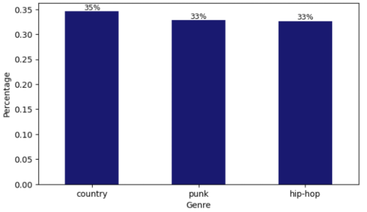
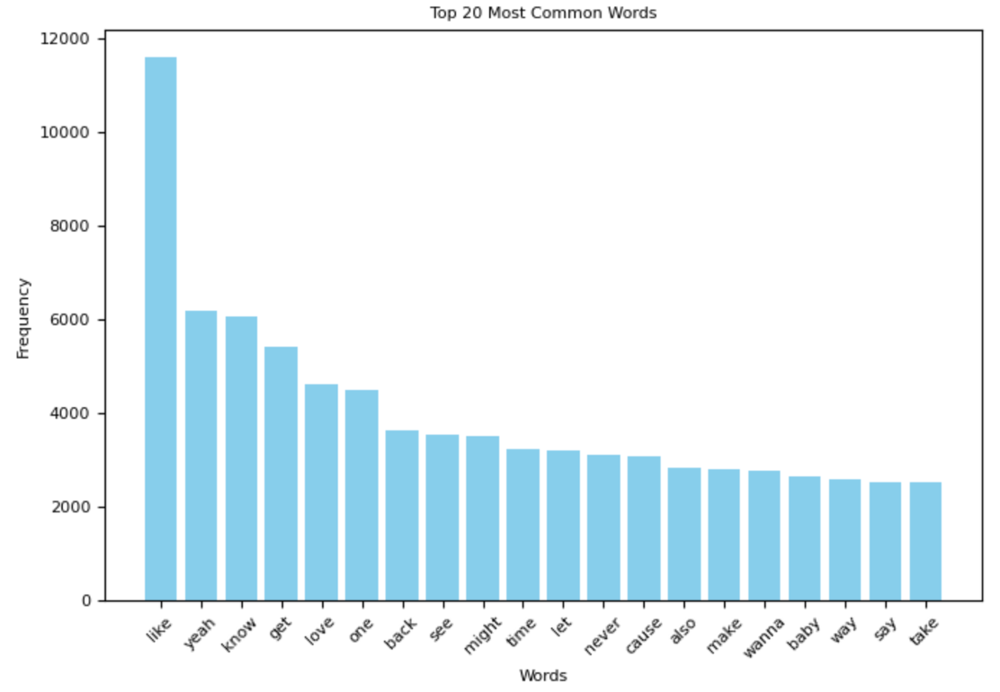
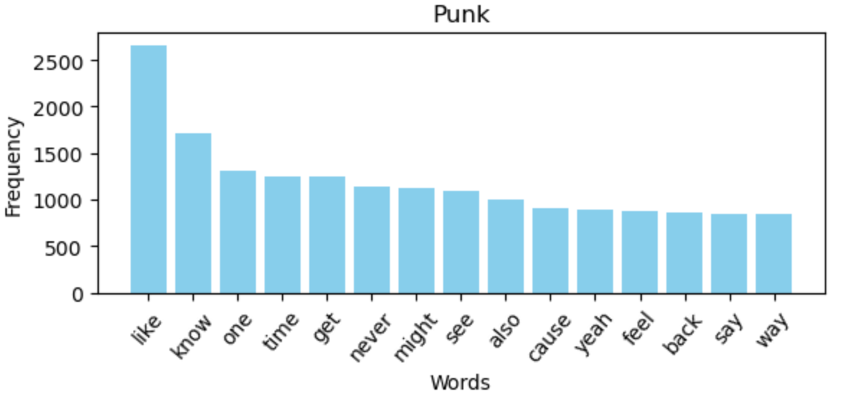
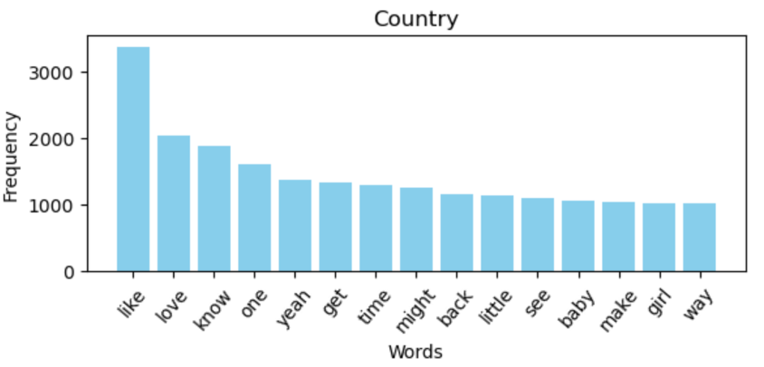
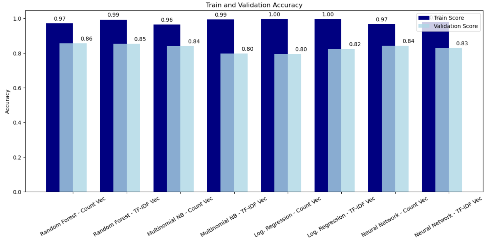
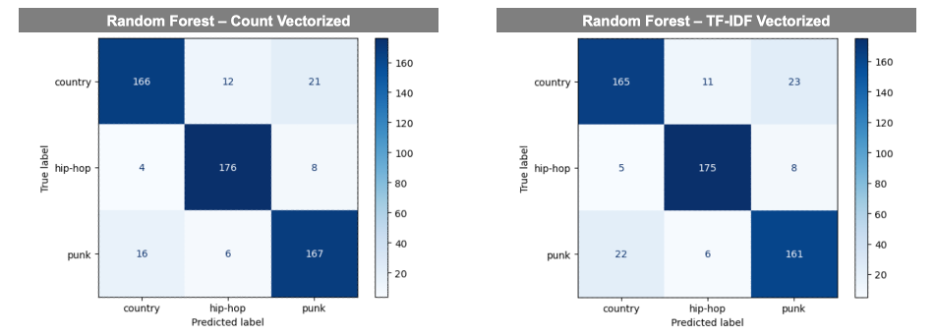

# Lyrics-NLP-Genre-Classifier

## Business Overview
Krueger Consulting (a firm of one) was contracted to explore the question, **"Can song lyrics be used to predict genre?"** I developed and evaluated a series of models using NLP anlaysis, including
1. Random Forest
2. Multinomial Naive Bayes
3. Logistic Regression
4. Neural Network

We evaluated model performance based on accuracy, as we are not particularly concerned about false positives or false negatives.

## Data Overview
The dataset used was compiled with a combination of the Spotify API and the Genius API. As this is the firm's first foray into tackling this complex business problem, we focussed solely on Hip-Hop, Punk, and Country tracks. These genres are known to have distinct lyrical themes that, in theory, distinguish them from both each other and other genres. The process was as follows:
1. Use Spotify API to download track names and artists from a number of genre based playlists for each of the three genres listed above
2. Genre tag each track based on its source playlist
3. Use the Genius API and the list of track names and artists to search Genius, download each track’s lyrics, and create a DataFrame with track name, artist, and lyrics
4. Save both standalone Spotify data and final DataFrame combining spotify data and genius lyrics to csv files for future use

The code associated with this process can be found [here](./Lyrics_Dataset.ipynb) . Additionally, duplicates were removed in the process.
The final dataset consists of 2,880 rows and four columns (track name, artist name, lyrics, genre, with track)

A list of the Spotify playlists used can be found [here](./Spotify_Playlists.txt) . As many of these playlists are updated on a regular basis, the dataset may change depending on when it is downloaded. The dataset used in this analysis was last downloaded on October 26th, 2023.

## Data Understanding
The final dataset is (by design) fairly balanced

Post tokenizing and removing stopwords, the dataset consists of 760,567 total tokens and 56,051 unique tokens. The top 20 tokens are:

Despite being known for having different lyrical themes, the three genres share many top words based on tracks in the dataset.

## Modeling
As stated above, I used random forest, multinomial naive bayes, logistic regression, and neural network models. Each was trained on both count vectorized and TF-IDF vectorized data. Hyperparameter tuning using GridSearchCV was performed on the random forest, multinomial naive bayes, and logistic regression models, and various parameters, such as kernal initializer and regularization factor, were flexed in tuning the neural network models.

Below is a comparison of train and validation scores:

Across the board train accuracy is significantly higher than validation accuracy, suggesting, despite hyperparameter tuning, the models are overfitting. This should be addressed as a next step. Given performance on both train and validation, both random forest models performed best; therefore, I evaluated both on unseen test data.

On unseen test data, the random forest model trained on count vectorized data had an accuracy of **88.4%** while the random forest model trained on TF-IDF vectorized data had an accuracy of **87.0%** . With that, the random forest model trained on count vectorized data is our final model and should be used going forward.

## Recommendations and Next Steps
I recommend using this model to create genre based playlists given a set of songs or to evaluate and tag genres of new songs that are added to a given streaming platform.

This model is only a starting point and there is room for significant improvement. I believe one or both of the following next steps are necessary to improve this model for future use:
1. Train model on a far larger dataset to improve model performance. With this, there is an opportunity to add additional genres to the analysis to build a more comprehensive and useful model
2. This problem cannot be solved with lyrics alone and there is an opportunity to add additional musical attributes as features in predicting genre

## Additional Materials
Please review my full analysis in this [Jupyter Notebook](./NLP_Lyrics_Genre_Classifier.ipynb) and this [Presentation](./Lyrics_NLP_Genre_Classifier_Pres.pdf) 

